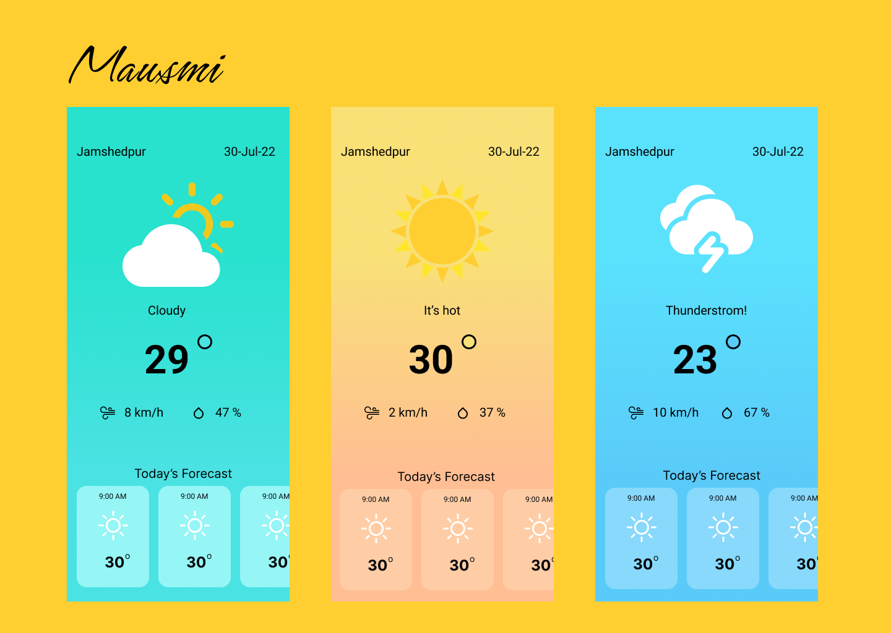

# Mausmi
This is an Android app that displays the current weather forecast for a user's current location. The app uses the Open-Meteo API to retrieve weather data and display it to the user in a user-friendly format.

## Installation
To install the app, simply clone or download the repository from GitHub and open it in Android Studio. Then, build and run the app on an emulator or an Android device

## Usage
Upon opening the app, the user will be prompted to allow access to their device's location. Once access is granted, the app will display the current temperature, humidity, and a brief description of the weather conditions at the user's current location.

